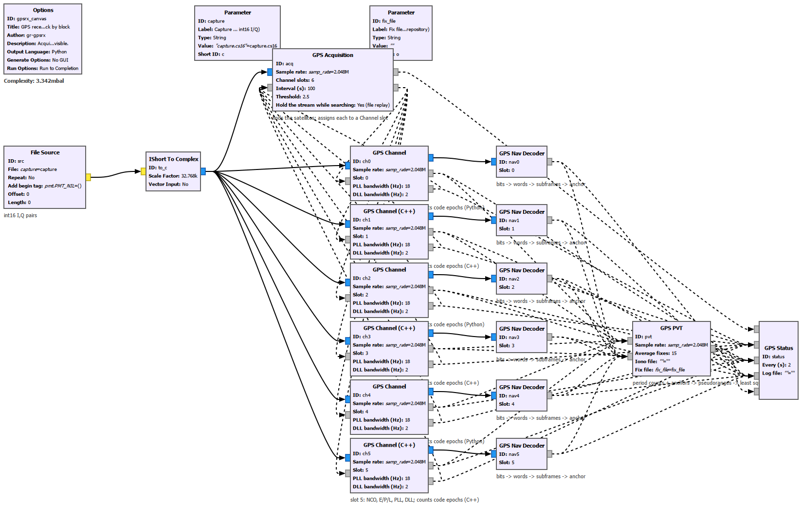
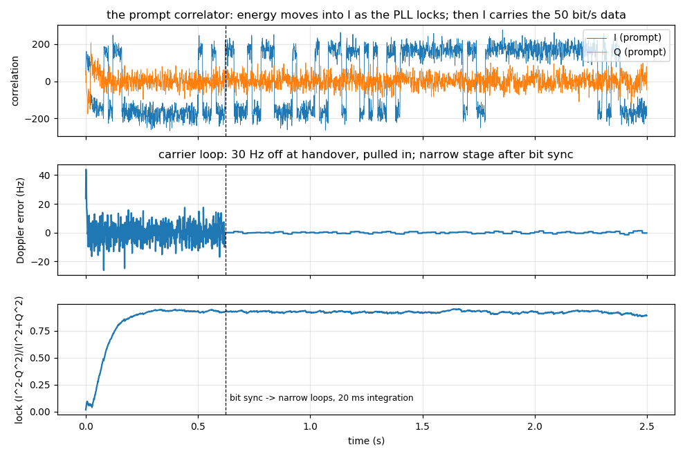
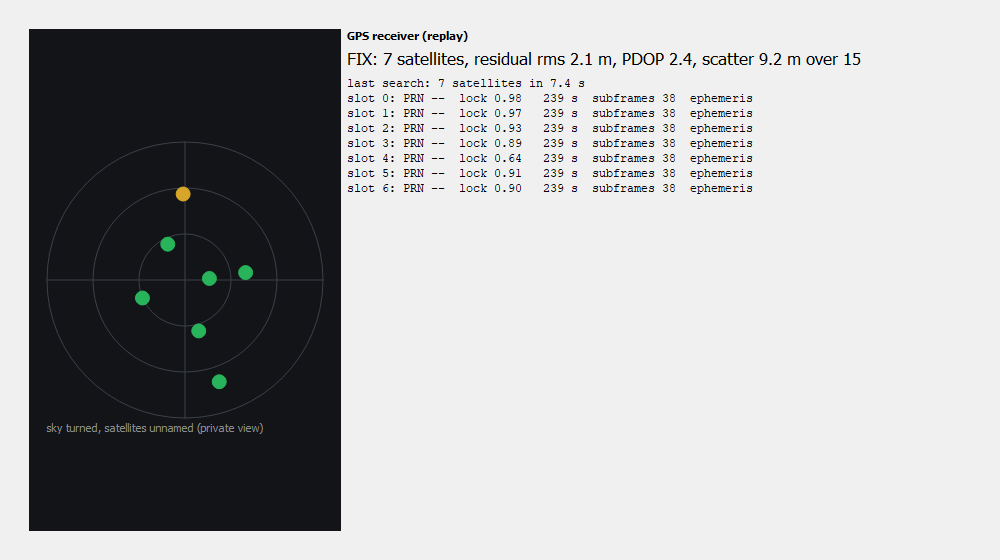

# gr-gpsrx

**A GPS + Galileo receiver made of GNU Radio blocks - the one you can read.**

> **Status (2026-09-22): it fixes, live, and it matches the reference receiver.** Every stage is
> a GNU Radio block (Acquisition, Channel in Python *and* C++, Nav Decoder, PVT, Status, Sky
> Panel, and a one-block Receiver). On an SDRplay RSPdx with an attic antenna a **live hour
> gave 3525 fixes, 99.8% valid, residual rms 1.9 m, 15-fix scatter 0.6 m**. On the same IQ as
> [gnss-sdr](https://github.com/gnss-sdr/gnss-sdr) it puts the antenna in the same place (means
> 3.7 m apart) with quieter raw fixes (1.1-1.7 m 15-epoch scatter against gnss-sdr's tuned
> 7.6 m; its Kalman output 1.6 m), and from a car at 52 mph it sits in the same lane, 2-3 m
> apart. **Galileo E1** is in - pilot-aided tracking on E1-C with I/NAV decoding, C++ and Python
> - a joint GPS + Galileo fix is quieter than GPS alone on the same samples (1.8 m vs 3.8 m
> settled scatter), and it runs **live**: 8 minutes on the RSPdx, four Galileo satellites tracked
> and decoded from the air, 426 fixes from 7 GPS + 3 Galileo, 100% valid, rms 2.2 m, 0.6 m scatter. Replay is deterministic to the millimetre. Every fix carries GPS time, the
> sample clock's drift, and the sample of the next whole second (a 1PPS on the sample clock).
> Eight C++ channels run at 15x real time on a PC and 13x on a Raspberry Pi 5. Windows
> (radioconda + MSVC), Linux and the Pi build from the same CMake; CI builds against Ubuntu's
> GNU Radio and runs the QA.

**Start with [`docs/WALKTHROUGH.md`](docs/WALKTHROUGH.md)** - the receiver one block at a time, with
figures made from synthetic satellites you can regenerate. Then `docs/DESIGN.md` (the receiver),
`docs/TEST_REPORT.md` (every measurement and every defect found on the way),
`docs/GNSS_SDR_COMPARISON.md` (the head-to-head and what was borrowed), `docs/PRIOR_ART.md`.

The point is educational: every stage of a GNSS receiver as a block on the canvas, every
intermediate as a message you can plot, and a real position at the end. The reference and
oracle is [numpy-gps](https://github.com/Felbs/numpy-gps), the offline pure-NumPy receiver
(whose 150 m error this project found and fixed); the receiver with every frequency and RTK
is gnss-sdr. This is the textbook, in the tool people use - and on L1 it now measures as well.

## The receiver

```
 samples ─► Acquisition ─► Channel x N (NCO, code, early/prompt/late, PLL, DLL) ─► prompts (1 kHz / 250 Hz)
                                │ observables: code-epoch count + the epoch's arrival sample     │
                                ▼                                                               ▼
                          PVT Solver  ◄──── ephemeris + timing anchor (period <-> TOW) ◄──── Nav Decoder
                                │ 'fix' ─► Status / Sky Panel / your file
```

| stage | file | what it is |
|---|---|---|
| codes | `cacode.py`, `gale1.py` | IS-GPS-200 C/A generator checked against the published chips; Galileo E1-B/E1-C memory codes (gnss-sdr's table) with the BOC(1,1) subcarrier |
| Acquisition | `acquire.py`, block in `acquisition.py` | parallel code-phase search, coherent x non-coherent, Doppler refined on 100 ms; finds the LO offset of a cheap crystal first (`lo_search_hz`); assigns satellites to channel slots; one block per system |
| Channel | `track.py`, block in `channel.py`; C++ twin `lib/channel_cc_impl.cc` | one satellite: wipe-off, three correlators (four for a pilot signal), Costas PLL, early-late DLL, one code period per step; **counts code epochs**. Two stages: wide 1 ms loops, then bit sync (or secondary-code sync on the Galileo pilot) and whole-bit coherent windows with narrow third-order loops. Same ports, tag and messages in both languages; the Python one is for reading, the C++ one for the radio |
| Nav decoder | `nav.py`, `nav_gal.py`, block in `nav_decoder.py` | GPS: preamble/parity framing in either polarity, subframes 1-4 -> ephemeris and Klobuchar, false frames rejected by continuity. Galileo: streaming I/NAV (Viterbi, deinterleave, CRC-24Q), ephemeris, GGTO. Both: **timing anchors** (which code period a subframe/page began on, and its TOW) |
| PVT | `pvt.py`, block in `pvt_solver.py` | orbit, SV clock, Sagnac, troposphere, ionosphere; carrier-smoothed pseudoranges; weighted least squares with an inter-system clock unknown; RAIM; a Kalman filter on the fixes; the timing product; warm start from kept ephemerides |
| Status, Sky Panel | `status_sink.py`, `sky_panel.py` (Qt) | the receiver's state, quality only - never the position (the panel's `private` view hides the PRNs and turns the sky) |
| Receiver | `receiver.py` | the whole chain as one hier block (`n_channels` GPS + `n_galileo` Galileo), every inner message port exposed |
| synthetic sky | `synth.py`, `navgen.py` | any satellites, Dopplers, C/N0s, Doppler rates, real nav messages with parity - so every test runs with no capture and no radio |

**What the streaming design buys.** An offline receiver must extrapolate each satellite's time
from a fitted anchor, which leaves a whole-millisecond ambiguity per satellite that it searches
over. A channel that runs continuously *counts*: every code period after the anchored subframe
is exactly one period of that satellite's clock, and the epoch's arrival is reported as a
fractional input sample. No ambiguity, no search; and with the acquisition snapshot on an exact
sample and the solve once per stream second, two replays of the same file differ by 0.000000 m.

## Run it

```
pip install numpy pytest pyyaml
NUMPY_GPS_DIR=/path/to/numpy-gps pytest -q tests                  # 23 engine tests, ~1 min, no GNU Radio
python python/gpsrx/qa_channel.py ; python python/gpsrx/qa_receiver.py    # the blocks, under GNU Radio

util\build_win.cmd                    # Windows: the C++ Channel (radioconda + VS Build Tools)
mkdir build && cd build && cmake .. && make && cd ..     # Linux / Raspberry Pi: as any OOT module
python python/gpsrx/qa_channel_cc.py  # C++ vs Python on the same sky, and the throughput gate

# a recording: interleaved int16 I/Q, 1575.42 MHz, 2.048 MS/s (GPS) or 4.096 MS/s (GPS + Galileo)
python apps/gpsrx_replay.py capture.cs16 --fix-file /somewhere/private/fix.json
python apps/gpsrx_replay.py wide.cs16 --rate 4.096e6 --galileo 4 --fix-file /somewhere/private/fix.json

# live, any SoapySDR radio (RSPdx, RTL-SDR with --lo-search 50000), with an ephemeris file for warm starts
python apps/gpsrx_live.py --fix-file /somewhere/private/live.json --eph-file /somewhere/private/eph.json
python apps/gpsrx_live.py --rate 4.096e6 --galileo 4 ...           # GPS + Galileo live (C++ channels)

grcc -o build/grc examples/*.grc                                   # the four flowgraphs
gnuradio-companion examples/gpsrx_canvas.grc                      # the one to read
```

From the source tree, `examples/_devpath.py` grafts `python/` onto the `gnuradio` package and
picks up the built C++ module (the apps and QA do this themselves); for GRC set
`GRC_BLOCKS_PATH` to this repo's `grc/`. The receiver prints satellites, lock, C/N0, subframes
or pages, residual rms, PDOP, scatter and GPS time; **the position goes only where you point the
fix file and is never printed.** Keep that file out of any repository.

Knobs that matter: `--pll-narrow` (5 Hz for a fixed antenna, 15 for a car), `--kf-vel-sd`
(0.05 static, 4 car), `--smoothing` (Hatch window, 100 epochs), `--engine python` to run the
readable channels instead of the C++ ones (0.17x real time for eight: replay only).







*The Sky Panel's private view: a named constellation at a known time can be inverted to a
rough position, so for screenshots the PRN numbers are hidden and the sky is turned by an
undisclosed angle. Everything else in the picture is as it ran.*

## Measured

All of it is in `docs/TEST_REPORT.md`; the headlines, no coordinates anywhere:

- **Live, one hour, RSPdx + attic antenna:** 3525 fixes at 1 Hz, 99.8% valid, median 7 satellites, rms 1.9 m, scatter 0.6 m raw / 0.4 m filtered, 4.5 m spread over the hour.
- **Against gnss-sdr on the same files:** same place (3.7 m), quieter raw epochs (1.1-1.7 m vs 7.6 m at 15 epochs); same lane from the car.
- **A drive, 27 x 90 s at up to 54 mph:** 27 of 27 fixed with warm start, rms 1-3 m; the third-order PLL keeps 5+ satellites through the 52 mph leg.
- **Galileo:** 4 satellites tracked pilot-aided, every I/NAV page CRC-clean; 7 GPS + 4 Galileo joint fix on a recording, PDOP 1.9, settled scatter 1.8 m vs 3.8 m GPS-only; **live**, 4 Galileo tracked and decoded, 426 fixes from 10 satellites, 100% valid, rms 2.2 m.
- **Time:** the sample clock's drift reads -796 ppb; numpy-gps measured the same TCXO at 796.7 ppb two months earlier.
- **Sensitivity** (synthetic): tracks and decodes to 34 dB-Hz. **Determinism:** two replays 0.000000 m apart.
- **Tests:** 23 engine tests (no GNU Radio), 6 flowgraph QA; CI on Ubuntu 24.04 against the distribution's GNU Radio.

## What is not done

- One frequency (L1/E1). No carrier-phase positioning, no RTK, no PPP, no SBAS - gnss-sdr has them.
- The Galileo pilot integrates 20 ms; the 100 ms window the secondary code allows needs a
  bandwidth ramp after the handover (measured: a direct switch does not lock).
- The wide LO search for RTL-SDR crystals is tested on synthetic satellites, not yet on the bench.
- Acquisition is snapshot-and-search every N seconds; a satellite rising mid-run is picked up at
  the next interval.
- GLONASS, BeiDou: not started.

## Licence

GPL-3.0-or-later. The C/A generator, the orbit/clock/atmosphere math, the I/NAV FEC/CRC/parser and
the field parser come from numpy-gps (MIT, Felbs); the Galileo E1 code table from gnss-sdr (GPL-3).
No captures, no positions, no coordinates are in this repository.
