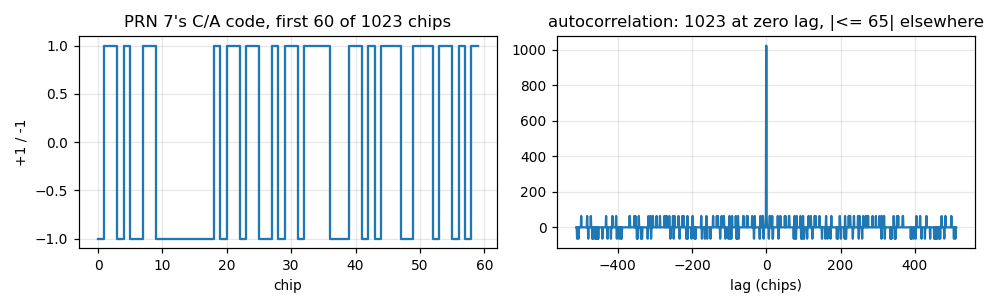
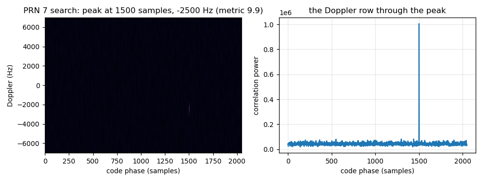
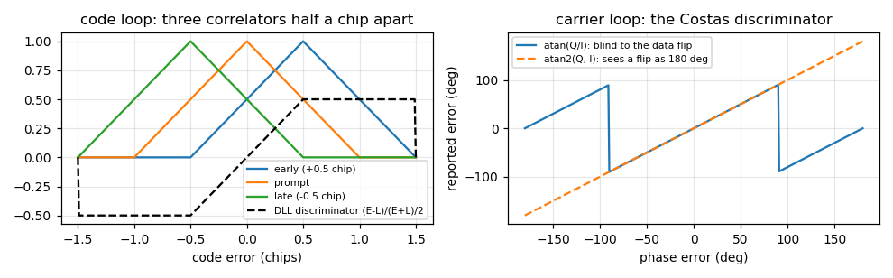
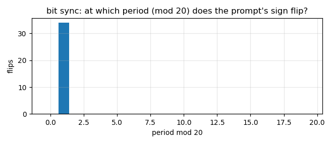
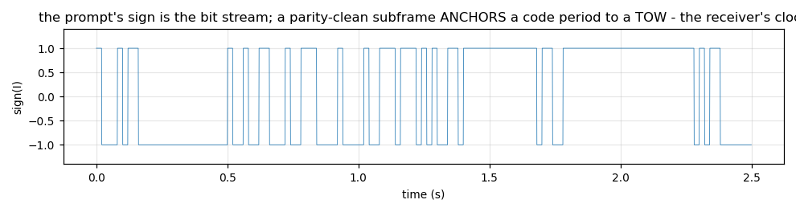

# A GPS receiver, one block at a time

This is the document gr-gpsrx was built for. Every stage of a GPS L1 C/A receiver is a block
you can put on the GNU Radio Companion canvas, every intermediate result is a message you can
watch, and the engine behind each block is a Python file you can read in an afternoon. The
figures here are all made from *synthetic* satellites (`util/make_figures.py`) so you can
regenerate them with no radio, no capture and no position. Where a number was learnt on real
air, it says so, with the measurement.

Open `examples/gpsrx_canvas.grc` alongside this text: the blocks below appear on it in this
order, left to right.

```
 samples ─► Acquisition ─► Channel x N ─► Nav Decoder x N ─► PVT ─► Status / Sky Panel
                │ 'sky'      │ 'obs'         │ 'nav'          │ 'fix'
                └ 'assign' ──┘ (slot, PRN, Doppler, code start)
```

## 0. What the signal is

Every GPS satellite transmits on the same frequency, 1575.42 MHz, and each is told apart by its
own 1023-chip pseudo-random code, repeated every millisecond, with the 50 bit/s navigation
message flipping the sign of the code every 20 repetitions. At the antenna the signal is about
20 dB *below* the thermal noise: you cannot see it on a spectrum analyser. What makes it
findable is the code's autocorrelation - 1023 at zero lag, no more than 65 anywhere else - so a
correlator lined up with the right code at the right time collects 1023 chips' worth of signal
while the noise adds up only as its square root.



`python/gpsrx/cacode.py` generates the 32 codes from the two shift registers in IS-GPS-200 and
checks every one against the first ten chips the specification prints in octal (`selfcheck()`).

## 1. Acquisition - which satellites, where

**Block:** `GPS Acquisition` (`acquisition.py`, engine `acquire.py`). **In:** the sample
stream. **Out:** `sky` (what was found), `assign` (one per new satellite: slot, PRN, Doppler,
and the absolute sample at which the code started).

A satellite's code arrives at an unknown phase (0..1023 chips) and an unknown Doppler shift
(+-5 kHz from orbit motion, plus whatever the radio's oscillator is off by). The search is the
classic parallel code-phase search: for each Doppler bin, wipe the carrier off one millisecond
of samples, FFT it, multiply by the conjugate FFT of the sampled code, inverse FFT - and the
result is the correlation at *every* code phase at once. Take the power, add up a few
milliseconds (non-coherently, because the data bit may flip between them), and the satellite is
the peak. The detection metric is peak over second peak, excluding one chip either side.



On real air (attic antenna, 100 ms non-coherent) the satellites present scored 3.7-22.7 and the
strongest absent PRN 1.7; the threshold is 2.5. The coarse Doppler bin is 250 Hz, wider than
the tracking loop can pull in, so each hit is refined to ~10 Hz by an FFT of 100 ms of squared
prompts (squaring removes the data bits).

**What acquisition tells you is where the code WAS.** The search takes seconds; by the time a
channel gets the assignment the code start it names is seconds in the past. The channel wraps it
forward - with the *Doppler-shifted* code period, because the code repeats 3 chips/s fast at
5 kHz of Doppler and the nominal period would be 22 chips wrong after a 7 s search (measured).

*Knobs:* `interval_s` (how often to search again), `threshold`, `lo_search_hz` (a cheap crystal -
an RTL-SDR - can sit 47 kHz off: one wide coarse pass finds the offset and every later search is
centred on it), `hold` (replay only: pause the file while a search runs, and start each channel
on an exact sample so the run is deterministic).

## 2. The Channel - one satellite's tracking loops

**Block:** `GPS Channel` (Python, `channel.py`, engine `track.py`) or `GPS Channel (C++)`
(`lib/channel_cc_impl.cc`, the same arithmetic line for line; eight of them run at 15x real
time on a PC, 13x on a Raspberry Pi 5 - the Python ones at 0.17x, which is why there are two).
Both take a `signal`: GPS L1 C/A, or Galileo E1 (the same loops on a 4092-chip BOC code with
quarter-chip spacing, the secondary code in place of bit sync, and a fourth correlator on E1-B
for the data - `gale1.py` has what differs).
**In:** the stream, `assign`. **Out:** the prompt correlation, one item per code period (a
1 kHz stream whose sign is the data), `obs` once a second, `status`.

Per code period the channel:

1. wipes the carrier off with its NCO (Doppler + phase, both tracked);
2. correlates with three copies of the code - early, prompt, late - half a chip apart;
3. runs the **PLL** on the prompt: the Costas discriminator `atan(Q/I)` gives the phase error in
   a way that does not care which sign the data bit has;
4. runs the **DLL** on early and late: `(E - L) / (E + L) / 2` is the code error in chips;
5. advances its code phase by the code rate times the samples consumed, and the next period
   begins at the sample where the code phase crosses 1023 chips.



That `atan` versus `atan2` distinction cost two hours: with `atan2` every data-bit transition
read as a 165-degree phase error, the loop slewed the carrier 100 Hz, and every bit flip was a
three-period glitch.

**The channel counts.** Its integer count of code periods since it started, plus the fractional
sample at which the last code epoch arrived, is the whole of what the position solver needs from
it. There is no millisecond ambiguity to search over, ever: once one period has been anchored to
a time of week (next block), every later period is exactly one more millisecond of that
satellite's clock. The `obs` message carries `epochs`, `epoch_sample`, `carrier_hz`,
`carrier_cycles` (the NCO's accumulated phase: the carrier-phase observable), `cn0_db` and `lock`.


**Two stages.** Wide loops (18 Hz PLL, 2 Hz DLL) and 1 ms integration pull in from acquisition's
30 Hz error. Then the channel finds the data-bit edges itself - it histograms at which period
(mod 20) the prompt's sign flips - and switches: narrow loops (15 Hz / 0.5 Hz; 5 Hz for a fixed
antenna), and the correlators summed over whole 20 ms bits, 13 dB more coherent gain, the
discriminators run once per bit on a 20x quieter number. This is what gnss-sdr does, and on
real air it took the 15-epoch position scatter from 11.4 m to 8.7 m.



Three things about that handover had to be learnt and are written in the code: the 20 ms stage
needs textbook loop gain (the 1 ms stage's gain constant goes over unity at 20 ms and the loop
tears itself apart); the first coherent window must start *on* a bit edge; and both loops must
be handed their *averaged* state - the 1 ms loops jitter +-10 Hz and +-1 chip/s, and a narrow
loop started from an instantaneous value walks the code off its peak.

*Knobs:* `pll_bw`, `dll_bw`, `pll_bw_narrow`, `dll_bw_narrow`, `coherent_ms`. *Try:* set
`pll_bw_narrow` to 0 and watch the Doppler jitter in the figure above stay at +-10 Hz.

## 3. The Nav Decoder - the satellite's clock and orbit

**Block:** `GPS Nav Decoder` (`nav_decoder.py`, engine `nav.py`). **In:** one channel's prompt
stream. **Out:** `nav` after every accepted subframe.

The sign of the prompt is the bit stream. Twenty periods make a bit, thirty bits a word, ten
words a subframe of six seconds, five subframes a frame. Each word carries six parity bits over
the previous word's last two and its own 24; each subframe opens with a fixed preamble and a
handover word that says the time of week the *next* subframe begins. Subframes 1-3 carry the
clock and the orbit (the ephemeris); subframe 4 page 18 the ionosphere model.



The decoder's most important output is not the ephemeris. It is the **anchor**: "subframe k's
first bit began on code period p, and that subframe's TOW is T". From then on the channel's
period count is the satellite's clock. A parity-clean *false* frame (ten words correct by chance -
it happens) is rejected by continuity: six seconds of TOW per 6000 periods, subframe ids
stepping 1-5. One got through before that check and put a satellite's residual at 10^13 m.

*Try:* connect a `Message Debug` to `nav` and watch the ephemeris fill in, field by field.

## 4. PVT - the position

**Block:** `GPS PVT` (`pvt_solver.py`, engine `pvt.py`). **In:** every `obs`, every `nav`, every
`status`. **Out:** `fix`.

For each channel with an anchor, an ephemeris and a fresh observable:

- transmit time (satellite clock) = anchor TOW + (epochs - anchor epochs) x 1 ms;
- every channel is slid to one common receive sample (the latest epoch arrival among them);
- the satellite clock correction is applied *after* that assembly (before it, `af0` alone can
  be half a millisecond - 150 km); the satellite's position at transmit time comes from the
  ephemeris; the Earth turns under the signal during its flight (Sagnac); the troposphere and
  ionosphere (Klobuchar) add delay;
- weighted least squares for x, y, z and the receiver clock, weights from elevation and C/N0;
- **RAIM**: a chi-square test on the weighted residuals; with six satellites, drop one at a
  time and keep the consistent subset; a fault that cannot be isolated makes the fix
  `valid: false` - reported, not believed.

Before the solve, the pseudoranges are **carrier-smoothed** (Hatch): the code range is noisy but
unbiased, the carrier's *change* between epochs is exact to millimetres, and blending them over
100 epochs took the static scatter from 10 m to 1.5 m. One correction the textbooks omit and a
real radio needs: the local oscillator sits a few Hz off its nominal, so the carrier's rate
differs from the code's by a constant that is the same for every satellite (-3.1 m/s on an
SDRplay). Harmless while every filter has the same age; the moment one satellite's filter
restarts it becomes a differential error of tens of metres. The median code-minus-carrier rate
across the satellites is removed each epoch.

After the solve, a constant-velocity **Kalman filter** on the fixes gives a smooth track and a
speed (`kf_vel_sd`: 4 for a car, 0.05 for a fixed antenna).

Two more things the solver has to know, each learnt from a capture: a channel's last observable
is not a measurement after the channel has lost its satellite (drop it, and anything older than
2.5 s); and a timing anchor dies with the channel's assignment (a re-acquired satellite restarts
its count).

*Knobs:* `smoothing`, `kf_vel_sd`, `eph_file` (warm start: every decoded orbit is kept and lent
to a channel that has timing but has not finished its own decode).

## 5. Status and the Sky Panel

`GPS Status` prints the receiver's state as text; `GPS Sky Panel` (Qt) draws the sky from the
fix's azimuths and elevations, one line per channel, and the fix's quality. Neither shows the
position: it is in the `fix` message and goes only where you point `fix_file`. The panel's
private view hides the PRN numbers and turns the sky, because a named constellation at a known
time can be inverted to a rough position.

## 6. What it does, measured

Everything below is on the same air as gnss-sdr, the reference receiver of the field
(`GNSS_SDR_COMPARISON.md` has the tables): a fixed antenna, 15-epoch scatter 1.1-1.7 m raw
(gnss-sdr's tuned tracking: 7.6 m; its Kalman-filtered output: 1.6 m); from a car at 52 mph,
the same lane as gnss-sdr, 2-3 m apart; a live hour on an SDRplay RSPdx at rms 2-3 m and 0.6 m
15-fix scatter. On synthetic satellites, tracking and decoding hold down to 34 dB-Hz.

## 7. What it does not do (yet)

One frequency. Galileo E1 is in - pilot-aided (`gale1.py`, `nav_gal.py`; needs 4 MS/s), in both
Channel engines (the C++ one carries the code tables, so `--galileo 4` works live), and a joint fix
beats GPS-only on the same samples (1.8 m vs 3.8 m scatter, settled; C++ and Python agree to
0.07 m per fix); the pilot runs a pure four-quadrant PLL after the secondary-code wipe and can
integrate the whole 100 ms sequence (the narrow loop's bandwidth is capped at 0.3 / window, so it
does). The FLL exists but buys nothing measurable (the 31 dB-Hz floor is the 1 ms first stage's
lock threshold). No carrier-phase positioning, no RTK.
